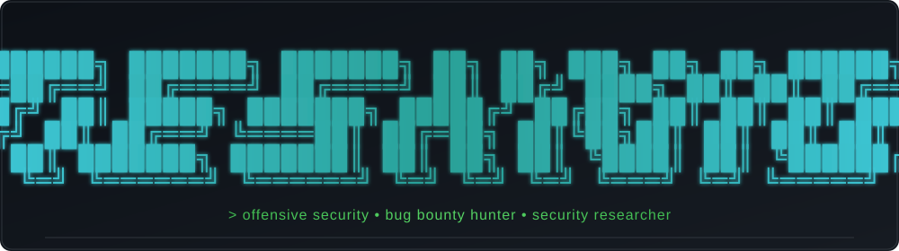
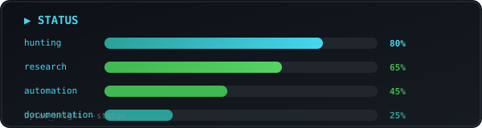

<div align="center">



<br/>

<a href="https://x.com/bytes_Knight"></a>
<a href="https://github.com/bytes-Knight"></a>

</div>

---

### 🧑‍💻 About Me

```
➜ ~/bytes-knight (main)
$ cat about_me.txt

name        : Bytes_Knight
focus       : Web Application Security
speciality  : Bug Bounty & Offensive Security
learning    : Advanced Exploitation & Research
philosophy  : Sharing knowledge makes everyone stronger.

$ █
```

---

### 🛠️ Tech Stack

<p align="center">
  
</p>

---

### 🎯 Interests

| | |
| --- | --- |
| 🌐 Web Application Security | 🔓 Authentication Testing |
| 🐛 Bug Bounty Hunting | 🤖 Recon Automation |
| 🔗 API Security | 🔬 Vulnerability Research |
| 📦 Open Source Projects | 📚 Continuous Learning |

---

### 📊 Status

<div align="center">



<br/>


</div>

| | |
| --- | --- |
| **🎯 STATUS** | ● active — hunting |
| **🔧 WEAPONS** | Python · Bash · Go · Rust · Burp Suite · nuclei · ffuf |
| **🤝 OPEN TO** | collaboration & bug bounty invites |

---

### 🏆 Achievements

| | | | |
| --- | --- | --- | --- |
| 🐛 **Bug Hunter** | 🔐 **Web Pentester** | 🕵️ **Recon Specialist** | ⚡ **API Security** |
| 🎯 **Red Team** | 🛡️ **Hardening** | 🧪 **PoC Developer** | 📚 **Researcher** |

---

### 🎯 Goals

- 🔍 Discover impactful security vulnerabilities
- 🛠️ Build open-source security tools
- 🤖 Automate reconnaissance workflows
- 🌍 Contribute to the cybersecurity community

---

> *"Security is not about breaking things. It's about understanding how they work."*

---

<p align="center">
  <b>Thanks for visiting!</b><br/>
  If you enjoy security research, consider following my work.<br/>
  ⭐ Star my repositories if you find them useful.
</p>
